# Global Superstore — Sales & Profitability Analysis

### Power BI Dashboard · Sales View · Profit View

> Built by **Rashad Alaa**
> A Power BI dashboard analyzing sales and profit performance for the Global Superstore dataset, built on a star-schema data warehouse in SQL Server. The Overview page toggles between a Sales View and a Profit View, filterable by year, region, segment, sub-category, and category.

🔗 **[Power BI Dashboard File](power_bi/dashboard.pbix)** · 📄 **[Full Report](docs/report.pdf)**


A single-page, toggleable Power BI dashboard covering total sales, profit, orders, margin, and AOV, broken down by category, segment, market, and ship mode. This document walks through each view: the visual and the key insight it shows.

> **Note:** this dashboard is intentionally simple — the focus of the project was on visual clarity and interactivity rather than exhaustive analysis. The Customer Behavior page is out of scope for this document.

---

## Key Performance Indicators

| KPI | Value | YoY % |
|---|---|---|
| Total Sales | $12.63M | 26.18% |
| Total Profit | $1.47M | 24.12% |
| Total Orders | 25K | 26.88% |
| Profit Margin % | 11.64% | -1.63% |
| AOV | 505.16 | -0.55% |

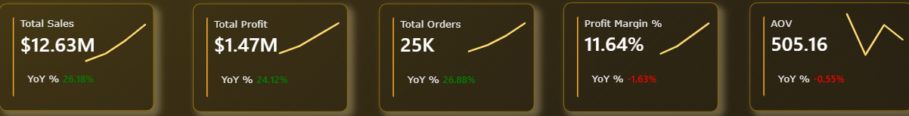

Sales, profit, and order volume all grew strongly year over year, while profit margin and AOV both declined slightly — suggesting growth was driven more by volume than by per-order value or efficiency.

---

## 1. Sales View

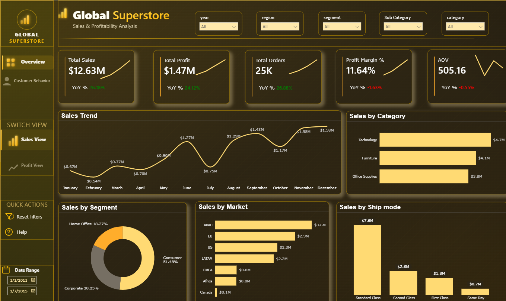

**Sales Trend**

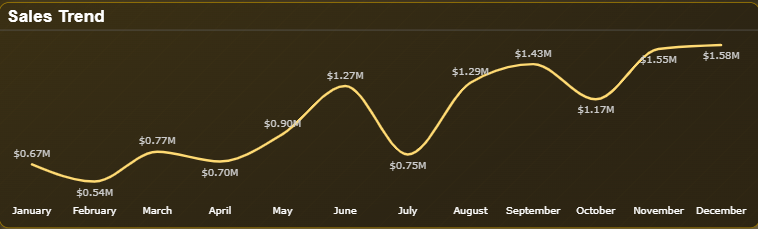

Sales ranged from a low of $0.54M in January to a high of $1.58M in December, with a mid-year dip to $0.75M in July before recovering into a strong Q4.

**Sales by Category**

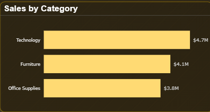

Technology leads with $4.7M, followed by Furniture ($4.1M) and Office Supplies ($3.8M) — a fairly even split across the three categories.

**Sales by Segment**

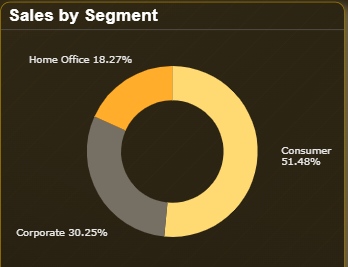

Consumer is the dominant segment at 51.48% of sales, ahead of Corporate (30.25%) and Home Office (18.27%).

**Sales by Market**

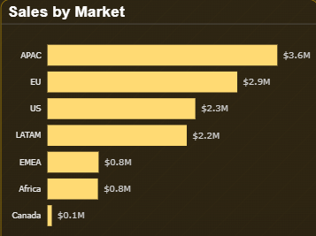

APAC is the top market ($3.6M), followed by EU ($2.9M), US ($2.3M), and LATAM ($2.2M). EMEA and Africa trail evenly at $0.8M each, with Canada negligible at $0.1M.

**Sales by Ship Mode**

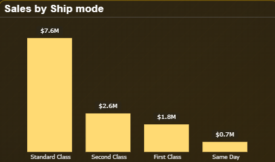

Standard Class dominates shipping at $7.6M — more than triple Second Class ($2.6M), with First Class ($1.8M) and Same Day ($0.7M) far behind.

---

## 2. Profit View

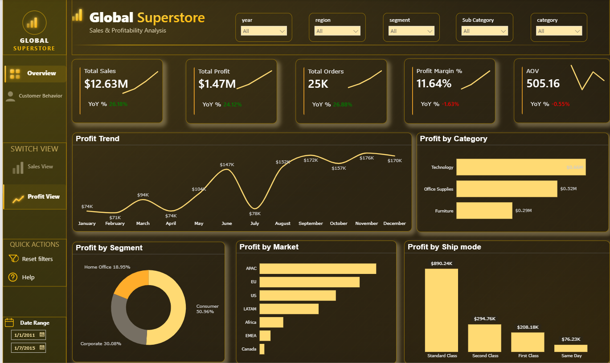

**Profit Trend**

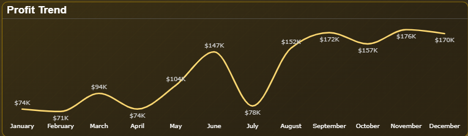

Profit is more volatile than sales month to month, dipping to $71K–$78K in February, April, and July, then climbing through Q3–Q4 to a peak of $176K in November before easing slightly to $170K in December.

**Profit by Category**

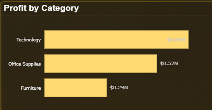

Technology generates the most profit ($0.66M), ahead of Office Supplies ($0.52M) and Furniture ($0.29M) — the same ranking as sales, but with a wider relative gap.

**Profit by Segment**

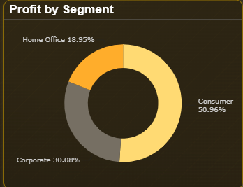

Consumer again leads at 50.96% of profit, closely mirroring its share of sales, followed by Corporate (30.08%) and Home Office (18.95%).

**Profit by Market**

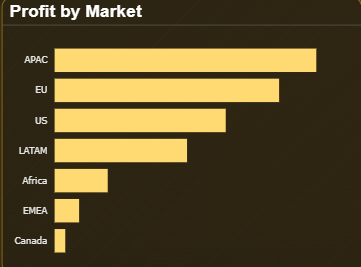

APAC contributes the most profit, followed by EU, US, and LATAM. Unlike in Sales (where EMEA and Africa tied), Africa outperforms EMEA in profit, with Canada lowest.

**Profit by Ship Mode**

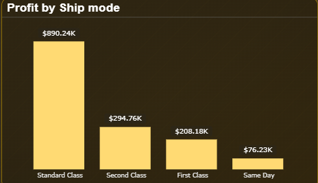

Standard Class again leads by a wide margin at $890.24K, versus $294.76K (Second Class), $208.18K (First Class), and $76.23K (Same Day) — profit concentration by ship mode is even steeper than for sales.

---

## Notes

- Sales and profit follow a broadly similar distribution across category, segment, market, and ship mode — no major misalignment between where revenue is generated and where it converts to profit.
- The main watch item is the slight YoY decline in Profit Margin % and AOV despite strong top-line growth, worth revisiting once the discount/pricing analysis layer is added to this project.

---

## Data Model

The dashboard is powered by a star schema built in SQL Server, rather than a flat file — set up with two scripts: `01_initialize_star_schema.sql` (creates the fact and dimension tables) and `02_load_star_schema.sql` (loads and maps the raw data into them).

**Fact table:** `fact_sales` — one row per order line (sales, profit, quantity, discount)

**Dimension tables:** `dim_date` · `dim_product` · `dim_customer` · `dim_location`

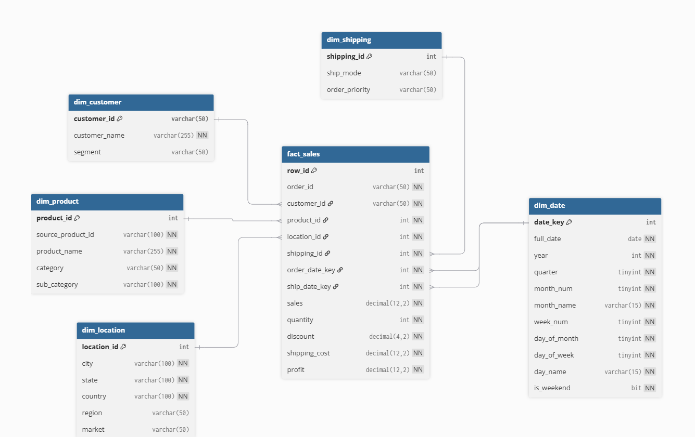

---

### Repo Structure
```
📦superstore-powerbi-analytics
 ┣ 📂data
 ┃ ┗ 📜superstore.zip
 ┣ 📂docs
 ┃ ┣ 📜guide.png
 ┃ ┣ 📜insight.md
 ┃ ┣ 📜overview_profit.png
 ┃ ┣ 📜overview_sales.png
 ┃ ┣ 📜reprot.pdf
 ┃ ┗ 📜star_schema.png
 ┣ 📂power_bi
 ┃ ┣ 📂screenshots
 ┃ ┃ ┗ 📂overview
 ┃ ┃   ┣ kpis.png
 ┃ ┃   ┣ profit_by_category.png
 ┃ ┃   ┣ profit_by_market.png
 ┃ ┃   ┣ profit_by_segment.png
 ┃ ┃   ┣ profit_by_shipmode.png
 ┃ ┃   ┣ profit_full.png
 ┃ ┃   ┣ profit_trend.png
 ┃ ┃   ┣ sales_by_category.png
 ┃ ┃   ┣ sales_by_market.png
 ┃ ┃   ┣ sales_by_segment.png
 ┃ ┃   ┣ sales_by_shipmode.png
 ┃ ┃   ┣ sales_full.png
 ┃ ┃   ┗ sales_trend.png
 ┃ ┣ dashboard.pbix
 ┃ ┗ README.md
 ┣ 📂sql
 ┃ ┣ 01_initialize_star_schema.sql
 ┃ ┗ 02_load_star_schema.sql
 ┗ README.md
```
