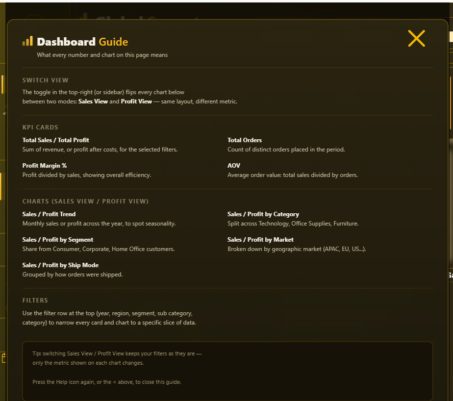

# Power BI — Global Superstore Dashboard

Technical notes for the `power_bi/` folder: the dashboard file, how to read it, and where it's headed next.

---

## Dashboard Guide

The report includes a built-in guide panel (accessible via the Help icon) explaining what each KPI card, chart, and filter on the page means — useful for anyone opening the dashboard without prior context.

---

## Future Work

This first iteration focuses on a single Overview page (Sales View / Profit View). Planned extensions include a **Profitability & Discount Analysis** page exploring the relationship between discount levels and margins, a **Customer Behavior Analysis** page covering segmentation and purchase patterns, and a deeper SQL/Python analytical layer beyond the current dashboard.